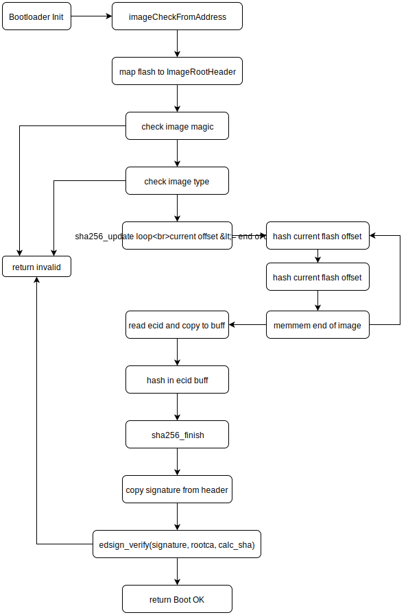

Enclave Bootloader + OS src tree
================================

Getting started
---------------

### Building
All the custom build scripts are for Windows and hackily refernce CLI tools such as Make statically. However, the all main arm-none-eabi-* toolchain building should be pretty standard for any OS.

##### General Build Options
QEMU_BUILD=1 --- Build bootloader for QEMU

DEBUG=1 	 --- Enables UART output along with a few other debug operations

### QEMU Build Routine
Make sure you're linking against the qemu.ld script in both the STM32F1 and EnclaveOS subprojects and QEMU_BUILD=1 is set in STM32F1/hardware.h

The bootloader wants an ECID at runtime for signature validation, using ```dfuimagemaker``` just include the ```-e``` arguement with all F's. This will sign the firmware for that the QEMU ECID, on QEMU builds the ECID is set to 'FFFFFFFFFFFFFFFFFFFFFFF' and slaps it in an image container (See Signing Enforcement)

e.g
```dfuimagemaker/imagemaker -f EnclaveOS/main.bin -t EDOS -v 0x41 -e FFFFFFFFFFFFFFFFFFFFFFF -p development -o signed_image.dfu```

Now you need to stitch the main OS to the bootloader with ```generate_dfu_firmware.py``` 

e.g 
```python generate_dfu_firmware.py STM32F1/build/enclave_stage1.bin signed_image.dfu qemu_image.bin```

### Generic STM32F103 ARM Board
Make sure you're linking the proper ld script in both the STM32F1 and EnclaveOS subprojects and QEMU_BUILD=0 is set in STM32F1/hardware.h 

> At the moment theres no utility to get the Unique ID (our ECID) from the boards, consider that a TODO.

The bootloader wants an ECID at runtime for signature validation, using ```dfuimagemaker``` just include the ```-e``` arguement with the boards ECID. This will sign the firmware for that boards ECID and slaps it in an image container (See Signing Enforcement)

e.g
```dfuimagemaker/imagemaker -f EnclaveOS/main.bin -t EDOS -v 0x41 -e FF566725748887167142607 -p development -o signed_image.dfu```

Flash the STM32F1 bootloader to ```0x08000000```

Using the Enclave DFU Flasher, upload the signed main OS image to the board over USB


### Signing Enforcement
On DFU upload and on boot the secondary main OS image data is hashed completely -- before calling sha256_finish we hash in the ECID as well. 

Basic boot validation scheme flow




> If the validation fails on DFU upload the device wipes the main OS flash pages (however this is currently broken) and returns to the DFU mode spin.
> If the validation fails on boot then we spin in DFU mode assuming the main OS has been tampered with, expects a reupload and revalidation. 

```dfuimagemaker``` does this and then Ed25519 signs it with our "rootCA", the signature is then copied to the image container header so we can read it back during boot and validate our calculated hash against the signature.  